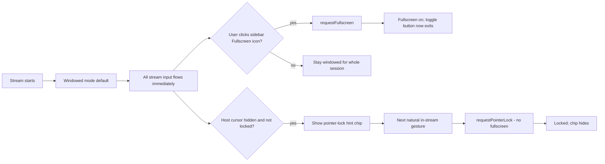

# Non-blocking Guidance Overlays

## Problem
Both `MoonlightFullscreenOverlayImpl` and `MoonlightPointerLockOverlayImpl` in [web/stream_overlays.ts](web/stream_overlays.ts) build a full-viewport `position:fixed; inset:0; pointer-events:auto` element. Even with the recent fade-out fix, the entire viewport is interactive while the prompt is visible. Stream input cannot reach the canvas/document until the user "clicks the prompt", and fullscreen is not required for streaming to work.

## Default behavior
- **Stream always starts in non-fullscreen (windowed) mode.** No auto-fullscreen, no first-gesture fullscreen, no startup prompt.
- The **only** way to enter fullscreen is the existing sidebar Fullscreen icon ([web/stream.ts](web/stream.ts) `fullscreenButton`, line 3367) and, when explicitly enabled by the user in settings, the `Ctrl+Shift+I` keybind (`toggleFullscreenWithKeybind`, default `false` per [web/default_settings.ts](web/default_settings.ts)).
- Pointer lock is also opportunistic, not gating; the new pointer-lock chip is a passive hint, not a modal.

## Goal
- Stream input always reaches the document, regardless of overlay state, fullscreen state, or pointer-lock state.
- No code path automatically requests fullscreen; it is strictly user-initiated via the sidebar icon (or the opt-in keybind).
- Visual guidance stays for pointer-lock only, as a small passive chip in a safe corner.

## Why fullscreen is NOT required
- Streaming, audio, input, and recovery flows do not depend on `document.fullscreenElement`.
- The intro overlay only existed to harvest a user gesture for `requestFullscreen`. With this plan we drop that flow entirely; the user explicitly opts into fullscreen via the sidebar Fullscreen icon when they want it.
- The sidebar button click is itself a real user activation, so `requestFullscreen` works from there without any extra UI.

## Design

## Proposed implementation

### 1. Drop the fullscreen intro overlay/flow
File: [web/stream.ts](web/stream.ts)

- Remove `beginStartupOverlays()` fullscreen branch (lines around 741-756): no `MoonlightFullscreenOverlay.show(...)`, no `waitingForFullscreenGesture`, no `requestFullscreen()` from startup path. `beginStartupOverlays()` becomes effectively `activateLoadingOverlayOnce()` only.
- Remove or no-op references to `fullscreenIntroSuppressed` since there is no auto prompt to suppress (lines 441, 822, 2081, 2132).
- `cleanupStartupOverlaysOnAbortOrUnmount()` no longer needs to call `MoonlightFullscreenOverlay.hide()`.
- The sidebar Fullscreen button click handler ([web/stream.ts](web/stream.ts) line 3375) is the single entry point to enter/exit fullscreen.
- The `Ctrl+Shift+I` keybind path (line 1419) is unchanged: it is opt-in via `toggleFullscreenWithKeybind`, default `false`.

File: [web/stream_overlays.ts](web/stream_overlays.ts)

- Reduce `MoonlightFullscreenOverlayImpl.show/hide/isVisible` to **no-op stubs** (return without rendering, isVisible returns false). This keeps any stale callers compiling while the overlay is fully removed at runtime. Document-level `keydown/pointerdown/touchstart/touchend/wheel/click` capture handlers in this overlay are deleted.

### 2. Replace pointer-lock overlay with a passive chip
File: [web/stream_overlays.ts](web/stream_overlays.ts)

- Rewrite `MoonlightPointerLockOverlayImpl`:
  - Outer root: optional dim/blur layer set to `pointer-events: none` (or removed entirely).
  - Inner CTA chip (`#mlplo-chip`): small pill near a non-critical corner (e.g. `bottom: 16px; left: 50%; transform: translateX(-50%)`), `pointer-events: auto`, `cursor: pointer`, with an x dismiss button.
  - Click on chip triggers `onRelock` and hides the chip.
  - Remove document-level capture handlers; only the chip is interactive.
  - Keep immediate `pointer-events: none` + opacity fade in `hide()` (already in place).
  - Add a `showId` token to avoid stale show/hide races between `pointerlockchange` and host cursor visibility transitions.
  - Keep `show/hide/isVisible` API stable.

### 3. Pointer-lock chip lifecycle and no-auto-fullscreen guarantee
File: [web/stream.ts](web/stream.ts)

- `showAdaptivePointerRelockOverlay()` now shows the passive chip; behavior outside that function is unchanged.
- Auto-dismiss the chip on:
  - `pointerlockchange` -> locked.
  - Host cursor becomes visible (`latestHostCursorHidden=false`).
  - User dismisses with x (clears `pendingEscRelockPrompt`).
- Audit `attemptAdaptivePointerRelock(trigger, withFullscreen=...)` and `tryAdaptivePointerRelockFromGesture(...)` to ensure `withFullscreen` is `false` everywhere except code paths that the user explicitly opted into (currently none in default config). This guarantees pointer-lock acquisition never silently flips into fullscreen.

### 4. Z-index and stacking
- Pointer-lock chip stays above stream canvas (e.g. `z-index: 100`) but below sidebar (`200000`) and recovery overlay (`100003`). Sidebar and recovery popup always take priority.

### 5. Accessibility + reduced motion
- Chip text uses `aria-live="polite"`.
- Honor `prefers-reduced-motion: reduce` to disable pulse/blur animations.
- Keyboard: chip is `<button>` so Tab/Enter works; removing the document-level keydown trap means typing in the stream is never intercepted.

## Files to change
- [web/stream.ts](web/stream.ts): drop fullscreen intro branch in `beginStartupOverlays`, prune `fullscreenIntroSuppressed`/`waitingForFullscreenGesture`, switch pointer-lock overlay invocations to chip semantics, ensure no automatic `withFullscreen=true` paths remain.
- [web/stream_overlays.ts](web/stream_overlays.ts): turn `MoonlightFullscreenOverlayImpl` into no-op stubs; rewrite `MoonlightPointerLockOverlayImpl` as a passive corner chip; delete the document-level capture handlers from both.

## Out of scope
- Changing pointer-lock or fullscreen request semantics beyond removing the auto-prompt path.
- Recovery popup, sidebar, or settings overlay UX.
- Any change to streaming/transport code.
- Changing the existing sidebar Fullscreen icon and `toggleFullscreenWithKeybind` setting (kept exactly as-is; default off).

## Risks / trade-offs
- Users who relied on the auto-prompt to discover fullscreen will now have to find the sidebar Fullscreen icon. Acceptable trade-off given the user-stated requirement of "always non-fullscreen by default".
- iOS/Safari: pointer lock is unreliable; the passive chip is no worse than the current viewport-wide overlay.
- Removing the fullscreen intro overlay slightly simplifies startup timing (no overlay to wait for), no negative impact expected.

## Validation
- Stream starts in windowed mode every time. No fullscreen overlay/chip ever appears at startup.
- Mouse, keyboard, touch, and gamepad input all work immediately in windowed mode for the entire session.
- Clicking the sidebar Fullscreen icon enters fullscreen; clicking it again exits. No popup or chip is required.
- `Ctrl+Shift+I` only toggles fullscreen when the user enables `toggleFullscreenWithKeybind`; default behavior is no keybind.
- Pointer-lock chip appears only when host cursor is hidden and lock is lost; it never blocks stream input.
- Dismissing the pointer-lock chip via x stops further prompts for that session and the user can keep playing windowed.
- DevTools console: no document-wide keydown/pointer listeners attached by `MoonlightFullscreenOverlay` during stream session.
- Recovery popup, sidebar, and modals continue to render above the pointer-lock chip.
