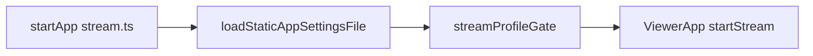

# Stream profiles (Performance / Balance / Quality)

## Current behavior

- Clicking a game opens [`web/component/game/index.ts`](web/component/game/index.ts) `stream.html?hostId=&appId=`.
- [`web/stream.ts`](web/stream.ts) `startApp()` loads static [`web/app_settings.ts`](web/app_settings.ts) defaults, then constructs `ViewerApp`, which immediately calls `getSettingsForApp(appId)` and [`startStream(...)`](web/stream.ts) — **no user step before the network session begins**.
- Effective settings are the existing stack: defaults from [`web/default_settings.ts`](web/default_settings.ts) + optional server [`web/app_settings.json`](web/app_settings.json) + `localStorage` `mlSettings` (see [`getSettingsForApp`](web/app_settings.ts)).

## Design decisions

1. **Where to gate** — Gate on **[`stream.html`](web/stream.ts) only** (in `startApp()`, after `loadStaticAppSettingsFile()`, **before** `new ViewerApp(...)`). That guarantees no WebRTC/WebSocket stream starts until a profile policy is applied, including bookmarked stream URLs. Optionally later you can add a lightweight hint on the main app (e.g. “Profile: Performance” on the games screen); not required for correctness.

2. **What a “profile” changes** — Each profile is a **`Partial<Settings>` overlay** applied only to **stream/transport/video/audio tuning fields** (e.g. `bitrate`, `packetSize`, `fps`, `videoFrameQueueSize`, `videoCodec`, `videoSize` / `videoSizeCustom` if you want per-tier resolution, `forceVideoElementRenderer`, `canvasRenderer`, `canvasVsync`, `audioSampleQueueSize`, `dataTransport`, `hdr`). **Do not** overwrite UX prefs like `sidebarEdge`, `pageStyle`, `mouseScrollMode`, `controllerConfig`, `hostUploadRelativeDir`, or `toggleFullscreenWithKeybind` unless you explicitly include them in the preset tables.

3. **Persistence** — On confirm:
   - Merge: `base = getLocalStreamSettings() ?? defaultSettings()` → apply overlay → `setLocalStreamSettings(result)`.
   - Optionally store `localStorage` `mlStreamProfile` = `performance` | `balance` | `quality` **only** for in-app labels (e.g. settings page “last chosen profile”) — **not** used to skip the gate on a later visit.
   - Preset **numeric fields** follow the product table in §Planned settings below (they are **not** required to match [`web/default_settings.ts`](web/default_settings.ts); Balance is a distinct “2K / 90 Hz / HEVC” tier, not legacy baseline).

4. **When to skip the gate** — **Do not** implement “remember me” or any browser persistence that auto-skips the picker on a subsequent `stream.html` load. The user picks a profile **every time** they open the stream page, except:
   - **`?profile=performance|balance|quality`** — apply preset, skip UI (deep link / automation / bookmarks you control).

5. **Manual tweaks vs profile** — If the user edits bitrate etc. in [`StreamSettingsComponent`](web/component/settings_menu.ts), either clear `mlStreamProfile` to a sentinel like `custom` or leave the label stale until they pick a profile again. Minimal first version: **clear `mlStreamProfile` when any stream-tuned control changes** (single listener) so the UI stays honest.

## Planned settings per profile (overlay fields only)

These are the **exact** `Partial<Settings>` values to implement in `STREAM_PROFILE_PRESETS`. They intentionally touch only stream/transport/video/audio fields listed in §Design decisions (2). UX prefs (`sidebarEdge`, `pageStyle`, `mouseScrollMode`, `controllerConfig`, `toggleFullscreenWithKeybind`, `useSelectElementPolyfill`, `hostUploadRelativeDir`) stay whatever the user already has in `mlSettings`.

**Units / conventions** (match codebase): `bitrate` is **kbps**; `packetSize` is bytes per Moonlight packet; `videoFrameQueueSize` and `audioSampleQueueSize` are queue depths.

**Product-defined core** (authoritative; all three tiers use **10000** kbps per product request):

| Tier | bitrate | packetSize | fps | videoCodec | videoSize (enum) | Notes |
|------|---------|------------|-----|--------------|------------------|--------|
| Performance | `10000` | `1024` | `60` | `h265` | *(see table below)* | |
| Balance | `10000` | `1024` | `60` | `h265` | `"1440p"` (“2K”) | No `"2k"` literal in [`Settings`](web/component/settings_menu.ts); use **`1440p`** (2560×1440) from [`VIDEO_PRESETS`](web/component/settings_menu.ts). |
| Quality | `10000` | `1024` | `60` | `h265` | `"4k"` | 3840×2160 via same preset table. |

**QA / host**: `fps: 90` requires host and Sunshine/GFE pipeline support; validate on target rigs. **4K at 10 Mbps** will be aggressively compressed; card UI may still advertise “4K” while noting bandwidth is capped if you add copy later.

### Performance

| Field | Value |
|--------|--------|
| `bitrate` | `10000` |
| `packetSize` | `1024` |
| `fps` | `60` |
| `videoCodec` | `"h265"` |

Resolution not specified by product: use **`videoSize` `"1080p"`** and **`videoSizeCustom` `{ width: 1920, height: 1080 }`** so Performance stays a lighter tier than Balance (2K) / Quality (4K).

| Field | Value |
|--------|--------|
| `videoFrameQueueSize` | `2` |
| `videoSize` | `"1080p"` |
| `videoSizeCustom` | `{ width: 1920, height: 1080 }` |
| `forceVideoElementRenderer` | `true` |
| `canvasRenderer` | `false` |
| `canvasVsync` | `false` |
| `playAudioLocal` | `false` |
| `audioSampleQueueSize` | `4` |
| `dataTransport` | `"webrtc"` |
| `hdr` | `false` |

### Balance (“2K”)

| Field | Value |
|--------|--------|
| `bitrate` | `10000` |
| `packetSize` | `1024` |
| `fps` | `60` |
| `videoCodec` | `"h265"` |
| `videoSize` | `"1440p"` |
| `videoSizeCustom` | `{ width: 2560, height: 1440 }` |
| `videoFrameQueueSize` | `4` |
| `forceVideoElementRenderer` | `true` |
| `canvasRenderer` | `false` |
| `canvasVsync` | `false` |
| `playAudioLocal` | `false` |
| `audioSampleQueueSize` | `6` |
| `dataTransport` | `"webrtc"` |
| `hdr` | `false` |

### Quality (4K)

| Field | Value |
|--------|--------|
| `bitrate` | `10000` |
| `packetSize` | `1024` |
| `fps` | `60` |
| `videoCodec` | `"h265"` |
| `videoSize` | `"4k"` |
| `videoSizeCustom` | `{ width: 3840, height: 2160 }` |
| `videoFrameQueueSize` | `6` |
| `forceVideoElementRenderer` | `true` |
| `canvasRenderer` | `false` |
| `canvasVsync` | `false` |
| `playAudioLocal` | `false` |
| `audioSampleQueueSize` | `12` |
| `dataTransport` | `"webrtc"` |
| `hdr` | `false` |

### Implementation notes

- **Apply order**: `structuredClone` / deep copy base → assign overlay keys → `setLocalStreamSettings`. For nested `videoSizeCustom` and `controllerConfig`, assign **whole objects** for overlay keys to avoid half-merged objects.
- **CONFIG.default_settings**: Server-injected defaults still apply to the baseline `defaultSettings()` object; profile overlay runs on top of **saved** `getLocalStreamSettings() ?? defaultSettings()` per §Design decisions (3). Document in code if you later want “profile ignores CONFIG” (not in this plan).
- **Card copy**: e.g. Performance “10 Mbps · 1024 · 60 · HEVC · 1080p”; Balance “10 Mbps · 1024 · 60 · HEVC · 1440p (2K)”; Quality “10 Mbps · 1024 · 60 · HEVC · 4K”.
- **HEVC**: Balance and Quality use `h265`; if QA finds decode/host issues, consider preset `auto` for those tiers only.

## UI (“production gaming grade”)

- New component, e.g. [`web/component/stream_profile_gate.ts`](web/component/stream_profile_gate.ts), returning a `Promise<StreamProfileId>` (or resolving after apply).
- **Visual language**: Reuse the tone of [`web/stream_overlays.ts`](web/stream_overlays.ts) (`MoonlightLoadingScreen`) — fixed `inset: 0`, `#0c0c10` base, subtle grid, soft glow, system UI font stack, crisp typography hierarchy.
- **Layout**: Three large cards (responsive: column stack on narrow viewports), each with title, 2–3 line summary, and key stats row (bitrate / FPS / codec or “Latency first” style labels — no fake benchmarks).
- **Accessibility**: Focus trap while open, `button` or `role="button"` cards, visible focus ring, **1 / 2 / 3** keyboard shortcuts, `Escape` only if you add a safe cancel path (otherwise omit cancel to match “must choose”).
- **Chrome**: Title e.g. “Choose stream mode”, primary CTA per card (click = confirm). **No** “remember me” checkbox and **no** `localStorage` / `sessionStorage` keys whose purpose is to skip the gate on a later visit.

Inject minimal **scoped CSS** in the gate module (same pattern as loading screen) **or** add a small block to [`web/styles/moonlight.css`](web/styles/moonlight.css) / [`web/styles/standard.css`](web/styles/standard.css) under a `.ml-profile-gate` prefix so both `pageStyle` themes stay readable.

## Code touchpoints

- **New** [`web/stream_profile_presets.ts`](web/stream_profile_presets.ts) (or under `web/component/`): `StreamProfileId`, `STREAM_PROFILE_PRESETS`, `applyStreamProfileToSettings(base: Settings, id: StreamProfileId): Settings`, `readProfileFromQuery(params): StreamProfileId | null`.
- **New** [`web/component/stream_profile_gate.ts`](web/component/stream_profile_gate.ts): builds DOM, returns Promise.
- **Edit** [`web/stream.ts`](web/stream.ts): `await runStreamProfileGate({ appId, queryParams })` before `new ViewerApp`; keep `loadStaticAppSettingsFile()` where it is so file defaults still sit under user prefs in `getSettingsForApp`.
- **Optional edit** [`web/component/settings_menu.ts`](web/component/settings_menu.ts): on any change to stream-tuned inputs, set `mlStreamProfile` to `custom` or remove key; optional read-only line “Active profile: …” driven by `mlStreamProfile`.

## Testing checklist

- Open stream from game list: gate appears, connection starts only after choice.
- Second visit to `stream.html` (same tab or new): **gate appears again** (no remember-me).
- `?profile=balance`: no gate, stream uses merged settings.
- PWA path (`display-mode: standalone`) and normal `window.open` still hit `stream.html` — same gate each time unless `?profile=` is present.
- HDR / codec combinations: verify host capability messages still behave (no change to server).
