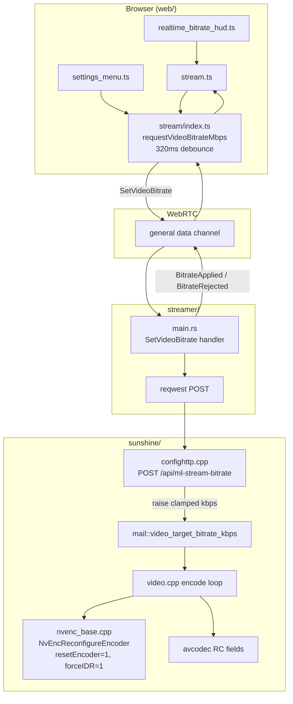
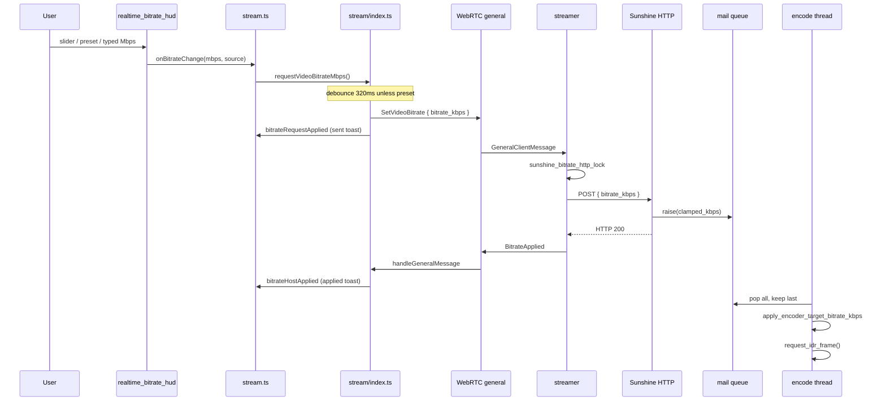

# Realtime bitrate change — flow and performance

This document describes how **target video encode bitrate** is changed in the current tree: what is implemented today, how data moves through the stack, and how that can affect stream performance.

For overlay HUD UI details, see [realtime-bitrate-hud.md](./realtime-bitrate-hud.md).

> **Note:** Some Sunshine-side **performance safeguards** (soft NVENC reconfigure, stale-queue drain at connect, encode warmup) were **reverted**. The realtime control path is still present; host behavior on each change is heavier than the earlier fork. See [Performance impact](#performance-impact).

---

## Ways bitrate is set

| When | Mechanism | Transport | Effect |
|------|-----------|-----------|--------|
| **Session start / profile gate** | `StartStream.bitrate` (Mbps → kbps) | Signaling WebSocket (`wss://…/api/host/stream`) | Host encoder configured when Moonlight/RTSP session starts |
| **Overlay HUD (Apply)** | User adjusts slider → **Apply** → `restartStreamWithNewSettings` | New `StartStream` with updated `mlSettings.bitrate` | Restarts stream in-page; **does not** re-show the profile gate. Slider range is profile-scoped (FHD 10–50, 2K 10–70, 4K 10–120 Mbps). See `stream_profile_presets.ts` + `realtime_bitrate_hud.ts`. |
| **While streaming (optional)** | `SetVideoBitrate { bitrate_kbps }` | WebRTC **`general` data channel** | Streamer POSTs to Sunshine without a full `StartStream`. Still used from the settings modal live change listener; **not** used by the overlay HUD slider. |

**Changing bitrate for the next session only:** update settings (`mlSettings` / stream settings) and reconnect — `StartStream` carries the new `bitrate` field.

---

## End-to-end flow (realtime)

### Component diagram



### Sequence diagram (user moves HUD slider)



On failure, streamer sends `BitrateRejected { bitrate_kbps, reason }` on **general**; the client shows a **not applied** toast.

---

## Layer-by-layer (current code)

### 1. UI entry points

| Source | File | Behavior |
|--------|------|----------|
| Overlay HUD | `web/component/realtime_bitrate_hud.ts` | 15–300 Mbps, 0.5 Mbps steps; slider, presets, typed value |
| HUD glue | `web/stream.ts` | `video-overlay-hud-tray`; `onBitrateChange` → `requestVideoBitrateMbps` |
| Settings modal | `web/stream.ts` (`StreamSettingsModal`) | Bitrate field change while streaming → `requestVideoBitrateMbps(..., "settings")` |
| Toggle | `settings_menu.ts` | `showStreamBitrateHud` shows/hides overlay control |

HUD is enabled on **`generalChannelReady`** (WebRTC `general` channel registered in `stream/index.ts` `setTransport`), not on `connectionComplete` alone.

### 2. Client session — `web/stream/index.ts`

- Converts **Mbps → kbps** for the wire (`Math.round(mbps * 1000)`).
- Minimum wire value: **500 kbps** (below that, send is skipped).
- **Debounce:** `bitrateDebounceMs = 320` for `overlaySlider` and `settings`; **immediate** for `preset` or `{ immediate: true }`.
- **Send:** `sendGeneralMessage({ SetVideoBitrate: { bitrate_kbps } })` on the **general** data channel.
- **Receive:** `BitrateApplied` / `BitrateRejected` → `stream-info` events and `[Moonlight][Bitrate]` console logs.
- **Initial bitrate:** `StartStream` uses `Math.round(this.settings.bitrate * 1000)` (kbps).

Signaling WebSocket is used for **StartStream**, SDP/ICE, `ConnectionComplete` — **not** for live bitrate commands.

### 3. IPC — `common/src/api_bindings.rs`

**Client → host (`GeneralClientMessage`):**

- `SetVideoBitrate { bitrate_kbps: u32 }`

**Host → client (`GeneralServerMessage`):**

- `BitrateApplied { bitrate_kbps }`
- `BitrateRejected { bitrate_kbps, reason }`

TypeScript: `web/api_bindings.ts`.

### 4. Streamer — `streamer/src/main.rs`

`on_packet` handles `GeneralClientMessage::SetVideoBitrate` and spawns `set_video_bitrate_via_sunshine`:

1. **`sunshine_bitrate_http_lock`** — serializes POSTs (overlapping slider values: last request runs after prior POST finishes).
2. Rejects `bitrate_kbps < 500` → `BitrateRejected` reason `too_low`.
3. Rejects if no active Moonlight stream → `no_active_stream`.
4. **POST** default URL: `https://{moonlight_host}:47990/api/ml-stream-bitrate`  
   Override: `SUNSHINE_BITRATE_URL`  
   TLS: `SUNSHINE_BITRATE_TLS_INSECURE` (permissive on loopback by default)  
   Auth header: `SUNSHINE_BITRATE_TOKEN` → `X-Sunshine-Bitrate-Token`
5. HTTP success → `BitrateApplied`; failure → `BitrateRejected` with short reason (`http_404`, `post_failed:…`, etc.).

**Important:** Streamer ack means Sunshine **accepted and queued** the target. Encoder apply happens later on the Sunshine encode thread.

### 5. Sunshine HTTP — `sunshine/src/stream.cpp`, `confighttp.cpp`

`ml_stream_bitrate_http_post` (`POST /api/ml-stream-bitrate`):

- **Loopback only** (403 otherwise).
- Optional env `SUNSHINE_BITRATE_TOKEN` (401 if mismatch).
- Exactly **one** `RUNNING` session (404 / 409).
- **Clamp** via `ml_clamp_target_bitrate_kbps_for_running_session` (min 500, `config::video.max_bitrate`, ABR min).
- **`sess->video.target_bitrate_kbps_q->raise(applied)`** — does not reconfigure in the HTTP thread.

There is **no** `drain_video_target_bitrate_queue()` at session start in the current tree (removed with the performance patch revert). Stale values left in the mail queue from a prior session can still be consumed when the encode loop runs.

### 6. Encoder apply — `sunshine/src/video.cpp`

Each encode iteration (both `encode_run` and the multi-session capture loop):

1. **Pop** all pending values from `target_bitrate_kbps_q`, **keep the last** (last-write-wins).
2. **Clamp** again with `ml_clamp_target_bitrate_kbps_for_running_session`.
3. **`apply_encoder_target_bitrate_kbps`:**
   - **NVENC:** `nvenc_encode_session_t::reconfigure_average_bitrate_kbps` → `nvenc_base::reconfigure_average_bitrate_kbps`.
   - **FFmpeg/avcodec:** update `bit_rate`, `rc_max_rate`, `rc_buffer_size`, etc.
4. **`ml_sync_session_after_bitrate_reconfigure`** — updates `config.monitor.bitrate`, `abr.max_bitrate_kbps`, caps `abr.current_bitrate_kbps`.
5. **`request_idr_frame()`** after a successful apply.

**NVENC reconfigure (current, post-revert)** in `sunshine/src/nvenc/nvenc_base.cpp`:

```cpp
reconf.resetEncoder = 1;
reconf.forceIDR = 1;
```

So each realtime change uses a **full encoder state reset** and **forced IDR** at the NVENC API level, in addition to the explicit `request_idr_frame()` in `video.cpp`. This is **not** the earlier “soft” path (`resetEncoder = 0`).

There is **no** encode-frame warmup skip and **no** “skip if target unchanged” check in the encode loop.

---

## Sources and client events

### `VideoBitrateChangeSource` (`web/stream/index.ts`)

| Source | Debounce | HUD toasts (sent / applied / rejected) |
|--------|----------|----------------------------------------|
| `overlaySlider` | ~320 ms | Yes |
| `preset` | Immediate | Yes |
| `settings` | ~320 ms | No |

### `stream-info` events (`web/stream.ts`)

| Event | When |
|-------|------|
| `bitrateRequestApplied` | `SetVideoBitrate` sent on **general** |
| `bitrateHostApplied` | `BitrateApplied` from streamer |
| `bitrateHostRejected` | `BitrateRejected` from streamer |

---

## What changes bitrate (summary)

| Piece | Role |
|-------|------|
| `realtime_bitrate_hud.ts` | User Mbps (overlay) |
| `stream/index.ts` | Debounce, wire protocol, ack handling |
| WebRTC **general** channel | Client ↔ streamer control |
| `streamer/main.rs` | HTTP proxy to Sunshine |
| `POST /api/ml-stream-bitrate` | Queue target on active session |
| Mail `video_target_bitrate_kbps` | Handoff to encode thread |
| `NvEncReconfigureEncoder` / avcodec RC | Encoder target |
| `StartStream.bitrate` | **Only** at session connect |

---

## Performance impact

### Versus restarting the stream

Realtime path still wins over sending another **`StartStream`**: no Moonlight teardown, no full RTSP re-negotiation, no client reconnect cycle.

### Cost of each live change (current tree)

| Step | Cost |
|------|------|
| Browser | Small `general` message; debounce limits rate |
| Streamer | One HTTPS POST (~5 s timeout); mutex-serialized |
| Sunshine NVENC | **`resetEncoder = 1`** + **`forceIDR = 1`** per apply — resets rate-control / internal encoder state |
| Sunshine (all paths) | Extra **`request_idr_frame()`** after apply |
| Slider drag | Debounced POSTs; queue coalesces to latest kbps on encode thread |

**Expectation:** Occasional bitrate tweaks are usually acceptable. **Frequent** slider movement or many presets in a row can cause visible hitches, brief quality swings, and in some setups **lower measured WebRTC FPS** (encoder busy with reconfigure + IDR).

### Risks after revert (no drain / no warmup / hard NVENC)

| Risk | Why |
|------|-----|
| Stale bitrate at connect | Queue is **not** drained when a session becomes `RUNNING`; a leftover HUD value from a previous session may apply soon after connect. |
| Early-session reconfigure | No “first N frames skip”; first queued value can reconfigure immediately. |
| Hard NVENC reset | `resetEncoder=1` is heavier than soft reconfigure and was associated with **measured FPS ~65–67 vs negotiated ~118** in some reports when combined with stale queue behavior. |

If you see that FPS pattern **without** touching the slider, check Sunshine logs for `Realtime video bitrate now` right after connect and consider clearing the queue at session start or restoring soft reconfigure (see `DetailDesign/user_bitrate_realtime_b84a3bc3.plan.md`).

### ABR

`ml_sync_session_after_bitrate_reconfigure` sets user target as **`abr.max_bitrate_kbps`** and `config.monitor.bitrate`. Sunshine ABR may still adjust **`abr.current_bitrate_kbps`** for send pacing in `stream.cpp`; encoder target is updated on the mail-queue path.

---

## Environment variables

| Variable | Where | Purpose |
|----------|--------|---------|
| `SUNSHINE_BITRATE_URL` | Streamer | Override POST URL |
| `SUNSHINE_BITRATE_TOKEN` | Streamer + Sunshine | Shared secret header / env check |
| `SUNSHINE_BITRATE_TLS_INSECURE` | Streamer | Accept Sunshine self-signed HTTPS |

---

## File index

| File | Role |
|------|------|
| `web/component/realtime_bitrate_hud.ts` | Overlay HUD |
| `web/stream.ts` | Tray, wiring, toasts |
| `web/stream/index.ts` | `requestVideoBitrateMbps`, acks, `StartStream` |
| `web/component/settings_menu.ts` | Bitrate Mbps, `showStreamBitrateHud` |
| `common/src/api_bindings.rs` | Message types |
| `streamer/src/main.rs` | `set_video_bitrate_via_sunshine` |
| `sunshine/src/confighttp.cpp` | HTTP route |
| `sunshine/src/stream.cpp` | HTTP handler, clamp, queue |
| `sunshine/src/video.cpp` | Encode-loop apply |
| `sunshine/src/nvenc/nvenc_base.cpp` | NVENC reconfigure |
| `docs/realtime-bitrate-hud.md` | HUD-focused doc |
| `DetailDesign/user_bitrate_realtime_b84a3bc3.plan.md` | Original design + planned safeguards |

---

## Debugging

1. **Console:** filter `[Moonlight][Bitrate]`.
2. **HUD disabled:** confirm `generalChannelReady` fired; `general` channel must be `data`.
3. **`rejected: no_active_stream`:** Moonlight encoder not running yet.
4. **HTTP / TLS errors:** `SUNSHINE_BITRATE_TLS_INSECURE=1` or fix `SUNSHINE_BITRATE_URL`.
5. **Sunshine:** `ml-stream-bitrate: queued target …` then `Realtime video bitrate now …` and `NvEnc: reconfigured streaming bitrate to …`.
6. **FPS gap at connect:** see [fps-diagnostics.md](./fps-diagnostics.md) — verify whether an unwanted realtime apply ran at startup.

---

## Related: session-start bitrate only

If the realtime stack is not deployed or POST fails, the only reliable way to change encode bitrate is:

1. Change **Bitrate (Mbps)** in stream settings (stored in `mlSettings`).
2. **Disconnect and reconnect** so a new `StartStream` is sent.

Resolution, codec, and FPS changes also require reconnect (or full `StartStream`); profile presets in `web/stream_profile_presets.ts` are not applied live for non-bitrate fields.
