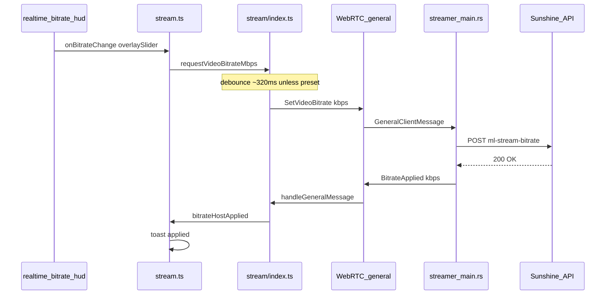

# Realtime bitrate HUD — architecture and flow

This document describes the on-stream **realtime bitrate** control: what it does, how data moves through the stack, and which files participate.

## Purpose

The realtime bitrate HUD lets the user change the **target video encode bitrate (Mbps)** while a session is active. It does **not** change in-game settings; it tells the host encoder path (via Sunshine’s HTTP API) how much bandwidth to aim for. The client converts to **kbps** only for `SetVideoBitrate` / Sunshine POST.

The **collapsed strip** is a single native `<input type="range">` layered over a tier bar. The **expanded panel** adds explanatory copy, a large readout, preset chips, and tier-specific hints.

Numeric bounds and snapping are defined in `web/component/realtime_bitrate_hud.ts` (15–300 Mbps, 0.5 Mbps steps, quartile-based tier labels).

## Layered architecture

| Layer | File(s) | Responsibility |
|--------|-----------|------------------|
| HUD component | `web/component/realtime_bitrate_hud.ts` | Builds DOM (`root`, strip, range, value edit, chevron, detail, presets, close). Local state: expanded, editing, last value in **Mbps**. Invokes `onBitrateChange(mbps, source)` for slider, presets, and committed numeric edit. |
| Stream UI glue | `web/stream.ts` | Creates HUD inside `video-overlay-hud-tray`; wires `onBitrateChange` → `requestVideoBitrateMbps`. Enables HUD on `generalChannelReady`; toasts for sent / applied / rejected. |
| Stream session | `web/stream/index.ts` | `requestVideoBitrateMbps`: debounce, `sendGeneralMessage(SetVideoBitrate)` on WebRTC **general** channel; handles `BitrateApplied` / `BitrateRejected` from host. |
| Streamer host action | `streamer/src/main.rs` | `set_video_bitrate_via_sunshine`: Sunshine POST; replies on **general** via `GeneralServerMessage`. |

Signaling WebSocket (`wss://…/api/host/stream`) remains for session lifecycle, WebRTC SDP/ICE, and `ConnectionComplete` — **not** for realtime bitrate command or ack.

## End-to-end flow (user moves slider)

On failure, streamer sends `BitrateRejected { bitrate_kbps, reason }` on the same **general** channel; the client shows a **not applied** toast (no `DebugLog` over WebSocket).

## Message types (`common/src/api_bindings.rs`)

**Client → host (general):** `GeneralClientMessage::SetVideoBitrate { bitrate_kbps }`

**Host → client (general):**

- `BitrateApplied { bitrate_kbps }`
- `BitrateRejected { bitrate_kbps, reason }`

## Sources (`VideoBitrateChangeSource`)

Defined in `web/stream/index.ts`:

- **`overlaySlider`** — HUD range or typed commit; **debounced** (~320 ms).
- **`preset`** — HUD preset buttons; **immediate** send.
- **`settings`** — stream settings modal; debounced unless `immediate`.

HUD toasts (sent / applied / rejected) show for `overlaySlider` and `preset` only.

## HUD enablement

The overlay slider is enabled on **`generalChannelReady`** (WebRTC `general` data channel listener registered in `setTransport`), not on `ConnectionComplete` alone. That avoids sending before the control channel exists.

## Debouncing and toasts

- **`bitrateRequestApplied`** — fired when the client successfully sends on **general** → **sent** toast.
- **`bitrateHostApplied`** — fired on `BitrateApplied` from host → **applied** toast.
- **`bitrateHostRejected`** — fired on `BitrateRejected` → **not applied** toast.

## Host side (Streamer)

`set_video_bitrate_via_sunshine` in `streamer/src/main.rs`:

- POST URL: `https://{moonlight_host}:47990/api/ml-stream-bitrate` (overridable with `SUNSHINE_BITRATE_URL`).
- Optional `SUNSHINE_BITRATE_TLS_INSECURE`, `SUNSHINE_BITRATE_TOKEN`.
- Rejects `bitrate_kbps < 500` and if no active Moonlight stream.
- Success/failure: `send_bitrate_general_applied` / `send_bitrate_general_rejected` → `OutboundPacket::General`.

## Styling

`web/styles/moonlight.css` and `web/styles/standard.css`: `.ml-rt-bitrate*`, `.ml-bitrate-toast--sent`, `--applied`, `--rejected`.

## Quick file index

| File | Role |
|------|------|
| `web/component/realtime_bitrate_hud.ts` | HUD DOM, snapping, tiers, presets |
| `web/stream.ts` | Tray, HUD wiring, toasts, `generalChannelReady` |
| `web/stream/index.ts` | Send/receive on general channel |
| `common/src/api_bindings.rs` | `GeneralClientMessage` / `GeneralServerMessage` |
| `streamer/src/main.rs` | Sunshine POST + general-channel ack |
| `web/component/settings_menu.ts` | `bitrate`, `showStreamBitrateHud` |
